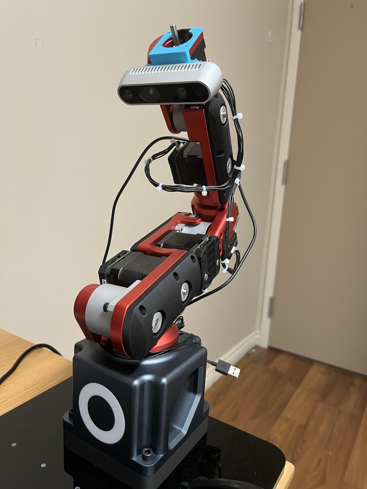

<!-- - how reception works -->
<!-- - how rs-daemon works -->
<!-- - what tools and libraries used -->
<!-- - currently working on? -->
<!-- - training lego -->
<!-- https://www.kaggle.com/datasets/ronanpickell/b100-lego-detection-dataset/data -->
<!-- https://docs.opencv.org/4.x/dc/dbb/tutorial_py_calibration.html -->

<!-- Improved compatibility of back to top link: See: https://github.com/othneildrew/Best-README-Template/pull/73 -->
<a id="readme-top"></a>
<!--
*** Thanks for checking out the Best-README-Template. If you have a suggestion
*** that would make this better, please fork the repo and create a pull request
*** or simply open an issue with the tag "enhancement".
*** Don't forget to give the project a star!
*** Thanks again! Now go create something AMAZING! :D
-->


<!-- PROJECT SHIELDS -->
<!--
*** I'm using markdown "reference style" links for readability.
*** Reference links are enclosed in brackets [ ] instead of parentheses ( ).
*** See the bottom of this document for the declaration of the reference variables
*** for contributors-url, forks-url, etc. This is an optional, concise syntax you may use.
*** https://www.markdownguide.org/basic-syntax/#reference-style-links
-->


<!-- PROJECT LOGO -->
<div align="center">
      <h2 align="center">3D Object Localization</h2>
    
</div>


<!-- TABLE OF CONTENTS -->
<details>
  <summary>Table of Contents</summary>
  <ol>
    <li>
      <a href="#about-the-project">About The Project</a>
    </li>
    <li>
      <a href="#getting-started">Getting Started</a>
    </li>
    <li>
      <a href="#rs-daemon">RS-Daemon</a>
    </li>
    <li>
      <a href="#reception">Reception</a>
    </li>
<!--     <li><a href="#usage">Usage</a></li> -->
<!--     <li><a href="#roadmap">Roadmap</a></li> -->
<!--     <li><a href="#contributing">Contributing</a></li> -->
<!--     <li><a href="#license">License</a></li> -->
<!--     <li><a href="#contact">Contact</a></li> -->
<!--     <li><a href="#acknowledgments">Acknowledgments</a></li> -->
  </ol>
</details>


<!-- ABOUT THE PROJECT -->
## About The Project

Using an existing robotic arm and Intel RealSense D435i, the 3D object localization project consists of two parts:
1. RS-Daemon that interfaces with the camera, and
2. reception application that processes data sent by RS-Daemon

### Why are there two separate programs?
The goal of this project is to eventually run the reception application on a Raspberry Pi.
This will be more efficient for running object detection with LibTorch as the rest of the robotic arm processes are also on RPi.

<p align="right">(<a href="#readme-top">back to top</a>)</p>

<!-- GETTING STARTED -->
## Getting Started

### Set up Intel RealSense driver
In this project, Ubuntu 24.04.02 is used to run the camera driver. Additionally, the kernel of Ubuntu needs to be 6.8
which is provided by linux-image-generic.

Follow these instructions to install kernel 6.8: https://ubuntuhandbook.org/index.php/2025/02/install-kernel-6-8-ubuntu-24-04/

Next, install librealsense2 and build from source code (recommended method)
https://github.com/IntelRealSense/librealsense/blob/master/doc/installation.md

Install DKMS package:
https://github.com/IntelRealSense/librealsense/blob/master/doc/distribution_linux.md

Finally, openssl-dev is needed for RS-daemon and reception application
```sh
sudo apt install libssl-dev
```

cleanup previously installed packages
```sh
dpkg -l | grep "realsense" | cut -d " " -f 3 | xargs sudo dpkg --purge
```

to verify installation, run in terminal:
```sh
rs-enumerate-devices
```

## RS-Daemon
main tasks of the program:
1. capture image upon receiving connection confirmation message from reception application
2. send image to reception application through UDP
3. get and send depth information of requested coordinates sent by reception application

areas of improvement:
* send RGB and depth info entire image at the same time to increase efficiency
* continuously check for image requests or send directly to reception application periodically

### Testing tool
There is a UDP client program under tools folder to test the RS-Daemon's UDP connection. The testing tool acts like the
reception application by connecting to RS-Daemon and receiving the captured image, except it only saves the received image
instead of processing it.

### Static file paths
The following static file paths need to be changed if the program was run in a different system:
1. captured image location (rs-daemon.cpp, send_image_file())
```sh
    char flname_recv[] ="/home/lily/perception/rsDaemon/build/rs-daemon-output-Color.png";
```
capture_color_frame() saves the image directly to current file path so the file path in send_image_file() needs to
match the file path where .exe file is located

2. received image location (udp_client.cpp, UdpClient::UdpClient())
```sh
    imageFileName = "/home/lily/work/rs-daemon/build/received.png";
```

## Reception
main tasks of the program:
1. connect to RS-Daemon and send image capture request
2. receive and save image from RS-Daemon through UDP
3. process image to detect objects and their associated x,y coordinates
4. send center coordinates of objects back to RS-Daemon to get depth info for objects

areas of improvement:
* locate desired/specified object

### Testing tool
There is a UDP server program under tools folder to test the reception application's UDP connection.
The testing tool acts like the RS-Daemon as it sends an image through UDP for reception to process.

Additionally, you can also test the image inference function separately using yolo_image_inference_local()
instead of yolo_image_inference()

### Static file paths
The following static file paths need to be changed if the program was run in a different system:
1. yolo model location (main.cpp, send_image_file())
```sh
    std::string model_path = "/home/lily/perception/reception/yolov8s.torchscript";
```

2. received image location (UdpClient.cpp, UdpClient::UdpClient())
```sh
    imageFileName = "/home/lily/perception/reception/received.jpg";
```


<!-- USAGE EXAMPLES -->
<!-- ## Usage -->

<!-- Use this space to show useful examples of how a project can be used. Additional screenshots, code examples and demos work well in this space. You may also link to more resources. -->

<!-- _For more examples, please refer to the [Documentation](https://example.com)_ -->

<!-- <p align="right">(<a href="#readme-top">back to top</a>)</p> -->


<!-- ROADMAP -->
<!-- ## Roadmap -->

<!-- - [x] Add Changelog -->
<!-- - [x] Add back to top links -->
<!-- - [ ] Add Additional Templates w/ Examples -->
<!-- - [ ] Add "components" document to easily copy & paste sections of the readme -->
<!-- - [ ] Multi-language Support -->
<!--     - [ ] Chinese -->
<!--     - [ ] Spanish -->

<!-- See the [open issues](https://github.com/othneildrew/Best-README-Template/issues) for a full list of proposed features (and known issues). -->

<!-- <p align="right">(<a href="#readme-top">back to top</a>)</p> -->


<!-- CONTRIBUTING -->
<!-- ## Contributing -->

<!-- Contributions are what make the open source community such an amazing place to learn, inspire, and create. Any contributions you make are **greatly appreciated**. -->

<!-- If you have a suggestion that would make this better, please fork the repo and create a pull request. You can also simply open an issue with the tag "enhancement". -->
<!-- Don't forget to give the project a star! Thanks again! -->

<!-- 1. Fork the Project -->
<!-- 2. Create your Feature Branch (`git checkout -b feature/AmazingFeature`) -->
<!-- 3. Commit your Changes (`git commit -m 'Add some AmazingFeature'`) -->
<!-- 4. Push to the Branch (`git push origin feature/AmazingFeature`) -->
<!-- 5. Open a Pull Request -->

<!-- ### Top contributors: -->

<!-- <a href="https://github.com/othneildrew/Best-README-Template/graphs/contributors"> -->
<!--    -->
<!-- </a> -->

<!-- <p align="right">(<a href="#readme-top">back to top</a>)</p> -->


<!-- LICENSE -->
<!-- ## License -->

<!-- Distributed under the Unlicense License. See `LICENSE.txt` for more information. -->

<!-- <p align="right">(<a href="#readme-top">back to top</a>)</p> -->


<!-- CONTACT -->
<!-- ## Contact -->

<!-- Your Name - [@your_twitter](https://twitter.com/your_username) - email@example.com -->

<!-- Project Link: [https://github.com/your_username/repo_name](https://github.com/your_username/repo_name) -->

<!-- <p align="right">(<a href="#readme-top">back to top</a>)</p> -->


<!-- ACKNOWLEDGMENTS -->
<!-- ## Acknowledgments -->

<!-- Use this space to list resources you find helpful and would like to give credit to. I've included a few of my favorites to kick things off! -->

<!-- * [Choose an Open Source License](https://choosealicense.com) -->
<!-- * [GitHub Emoji Cheat Sheet](https://www.webpagefx.com/tools/emoji-cheat-sheet) -->
<!-- * [Malven's Flexbox Cheatsheet](https://flexbox.malven.co/) -->
<!-- * [Malven's Grid Cheatsheet](https://grid.malven.co/) -->
<!-- * [Img Shields](https://shields.io) -->
<!-- * [GitHub Pages](https://pages.github.com) -->
<!-- * [Font Awesome](https://fontawesome.com) -->
<!-- * [React Icons](https://react-icons.github.io/react-icons/search) -->

<!-- <p align="right">(<a href="#readme-top">back to top</a>)</p> -->


<!-- MARKDOWN LINKS & IMAGES -->
<!-- https://www.markdownguide.org/basic-syntax/#reference-style-links -->
<!-- [contributors-shield]: https://img.shields.io/github/contributors/othneildrew/Best-README-Template.svg?style=for-the-badge -->
<!-- [contributors-url]: https://github.com/othneildrew/Best-README-Template/graphs/contributors -->
<!-- [forks-shield]: https://img.shields.io/github/forks/othneildrew/Best-README-Template.svg?style=for-the-badge -->
<!-- [forks-url]: https://github.com/othneildrew/Best-README-Template/network/members -->
<!-- [stars-shield]: https://img.shields.io/github/stars/othneildrew/Best-README-Template.svg?style=for-the-badge -->
<!-- [stars-url]: https://github.com/othneildrew/Best-README-Template/stargazers -->
<!-- [issues-shield]: https://img.shields.io/github/issues/othneildrew/Best-README-Template.svg?style=for-the-badge -->
<!-- [issues-url]: https://github.com/othneildrew/Best-README-Template/issues -->
<!-- [license-shield]: https://img.shields.io/github/license/othneildrew/Best-README-Template.svg?style=for-the-badge -->
<!-- [license-url]: https://github.com/othneildrew/Best-README-Template/blob/master/LICENSE.txt -->
<!-- [linkedin-shield]: https://img.shields.io/badge/-LinkedIn-black.svg?style=for-the-badge&logo=linkedin&colorB=555 -->
<!-- [linkedin-url]: https://linkedin.com/in/othneildrew -->
<!-- [product-screenshot]: images/screenshot.png -->
<!-- [Next.js]: https://img.shields.io/badge/next.js-000000?style=for-the-badge&logo=nextdotjs&logoColor=white -->
<!-- [Next-url]: https://nextjs.org/ -->
<!-- [React.js]: https://img.shields.io/badge/React-20232A?style=for-the-badge&logo=react&logoColor=61DAFB -->
<!-- [React-url]: https://reactjs.org/ -->
<!-- [Vue.js]: https://img.shields.io/badge/Vue.js-35495E?style=for-the-badge&logo=vuedotjs&logoColor=4FC08D -->
<!-- [Vue-url]: https://vuejs.org/ -->
<!-- [Angular.io]: https://img.shields.io/badge/Angular-DD0031?style=for-the-badge&logo=angular&logoColor=white -->
<!-- [Angular-url]: https://angular.io/ -->
<!-- [Svelte.dev]: https://img.shields.io/badge/Svelte-4A4A55?style=for-the-badge&logo=svelte&logoColor=FF3E00 -->
<!-- [Svelte-url]: https://svelte.dev/ -->
<!-- [Laravel.com]: https://img.shields.io/badge/Laravel-FF2D20?style=for-the-badge&logo=laravel&logoColor=white -->
<!-- [Laravel-url]: https://laravel.com -->
<!-- [Bootstrap.com]: https://img.shields.io/badge/Bootstrap-563D7C?style=for-the-badge&logo=bootstrap&logoColor=white -->
<!-- [Bootstrap-url]: https://getbootstrap.com -->
<!-- [JQuery.com]: https://img.shields.io/badge/jQuery-0769AD?style=for-the-badge&logo=jquery&logoColor=white -->
<!-- [JQuery-url]: https://jquery.com -->
